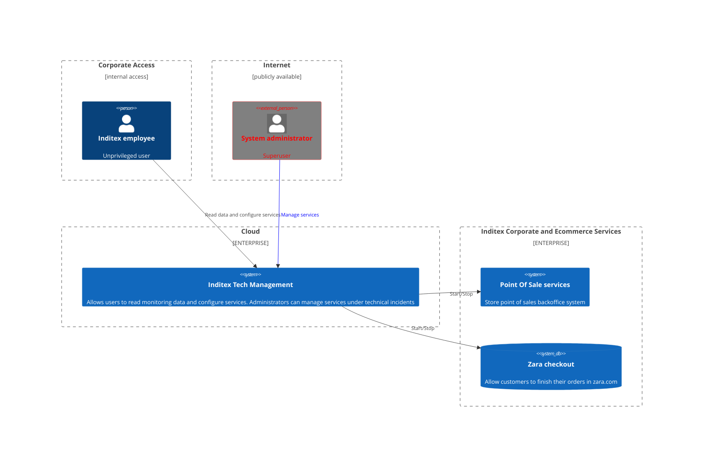

  

  <h3 align="center">Inditex Tech Management</h3>

  

    In the dynamic landscape of modern business, ensuring seamless coordination and efficient management of diverse services within a company is paramount. Inditex Tech Management is a cutting-edge application designed to revolutionize the way retail businesses handle their myriad services. This innovative platform serves as a centralized hub, streamlining and optimizing the management of all company services with unparalleled ease and efficiency.
  

<!-- TABLE OF CONTENTS -->

  
Table of Contents

  <ol>
    <li><a href="#about">About</a></li>
    <li><a href="#usage">Usage</a></li>
    <li>
      <a href="#threat-modeling">Threat model</a>
      <ul>
        <li><a href="#architecture">Architecture</a></li>
        <li><a href="#assumptions">Prerequisites</a></li>
        <li><a href="#threats">Installation</a></li>
      </ul>
    </li>
    <li><a href="#roadmap">Roadmap</a></li>
    <li><a href="#contributing">Contributing</a></li>
    <li><a href="#license">License</a></li>
    <li><a href="#contact">Contact</a></li>
    <li><a href="#acknowledgments">Acknowledgments</a></li>
  </ol>

## About 

Gone are the days of navigating through multiple disjointed systems and struggling with disparate tools. Inditex Tech Management integrates seamlessly with various service modules, offering a unified interface that empowers business to oversee and enhance their operations comprehensively. Whether it's IT services, customer support, facilities management, or any other vital aspect of our organization, this application provides a one-stop solution to monitor, analyze, and optimize every service under company's umbrella.

(<a href="#readme-top">back to top</a>)

## Usage

>  **UNDER CONSTRUCTION**

(<a href="#readme-top">back to top</a>)

## Threat Model

### Architecture

### Assumptions
* Corporate employees use corporate secure laptops to access the application
* The system administrators are subcontracted to a supplier company. They need to have access to the application from Internet
* We cannot protect against threats on the laptops of the suppliers, but we have a contract that protects us
* The supplier company uses only one user account to access the application, which it shares among its employees
* We cannot rotate the password due to the risk of leaving the supplier company without access
* TLS is an adequate mitigation for threats related to tampering and information disclosure of data in transit over the network
* Programmers follow secure development best practices and the corporate software lifecycle

### Threats

* **T1:** An internet-based threat actor without user permissions can use known exploits to attack vulnerabilities in the application which leads to the integrity of the system compromised, negatively impacting business operations

* **T2:** A dissatisfied employee who has normal access can tamper services configuration data which leads to hange the normal operation of services, negatively impacting the services to which they have access

* **T3:** An internet-based threat actor with access to a supplier account credentials can spoof an administrator which leads to stop corporate services, negatively impacting the entire company: sales services, logistics, manufacturing, ...

### Controls

|  Control | Mitigated Threat  | Implemented  | Notes  |
|---|---|---|---|
| C1: Employ automated patch management tools to facilitate flaw remediation to the following system components  | T1  | Yes  |   |
| C1: Protect application using WAF and bot services   | T1  | Yes  |   |
| C2: Log user actions in the application: user, date and time, action performed  | T2  | Yes  |  Logs are deleted every 3 months |
| C3: Provide a different user account per administrator of the supplier company (current format: _srvc_adm\<name\>_)  |  T3 | No  |  Planned for next year |
| C3: Enable 2FA and rotate administrator passwords |  T3 | No  |  Unplanned  |

(<a href="#readme-top">back to top</a>)

<!-- ROADMAP -->
## Roadmap

- [ ] Dashboard and Overview:
  * A customizable dashboard providing an overview of all active services.
  * Quick access to key performance indicators (KPIs) for each service.
- [ ] AI because is cool

See the **open issues** for a full list of proposed features (and known issues).

(<a href="#readme-top">back to top</a>)

<!-- CONTRIBUTING -->
## Contributing

Contributions are what make the Inditex such an amazing place to learn, inspire, and create. Any contributions you make are **greatly appreciated**.

(<a href="#readme-top">back to top</a>)

<!-- LICENSE -->
## License

Distributed under the InSec License.

(<a href="#readme-top">back to top</a>)

<!-- CONTACT -->
## Contact

Za Cappa - za.cappa@email_client.com

(<a href="#readme-top">back to top</a>)

<!-- ACKNOWLEDGMENTS -->
## Acknowledgments

* Luis Arconada
  
